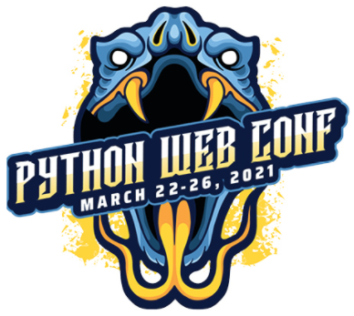

# Automating AWS with Python: The Easy Way To The Cloud

## Python Web Conference 2021

## <https://2021.pythonwebconf.com/>

## [MONDAY,  MAR 22 | 09:00AM - 12:00PM US ET](https://2021.pythonwebconf.com/tutorials/automating-aws-with-python-the-easy-way-to-the-cloud)

## David Sol

### T-Systems Cloud Architect

### Twitter: [@soldavidcloud](https://twitter.com/soldavidcloud)

### Repository: <https://gitlab.com/soldavid/pwc2021-aws>

### Main File: Jupiter Notebook PWC2021.ipynb
